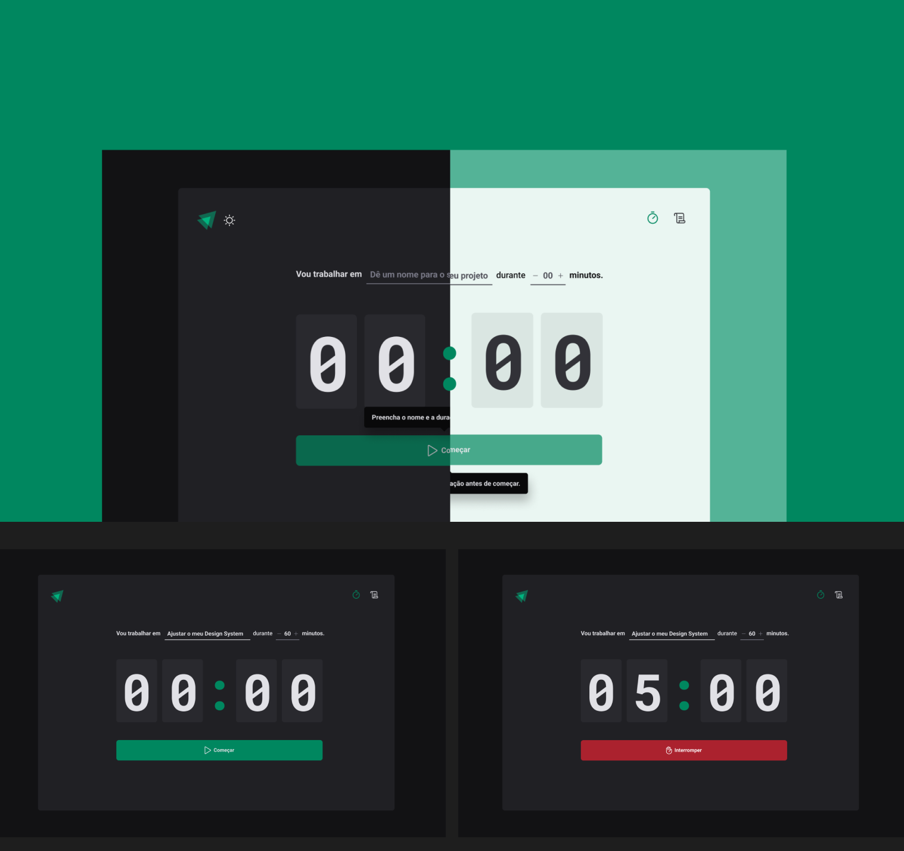

# Timer

<p align="center">
  
</p>

## Sobre o projecto

A ideia do projecto é:

Uma aplicação que funcione se baseando na técnica Pomodoro, onde definimos um determinado período de tempo para a realização de uma tarefa. Durante esse período devemos focar somente na tarefa que estamos envolvidos 

## Instalação

### Pré-requisitos

Para executar este projecto em modo desenvolvimento, você precisa ter o [Node.js](https://nodejs.org) instalado, junto com NPM ou [Yarn](https://yarnpkg.com/) para gerenciamento de pacotes.

**Clonando o repositório & Instalando dependências**

```
$ git clone https://github.com/daniel-koti/timer

$ cd timer

$ npm install

$ npm run dev
```

## Ferramentas utilizadas

- [React.js](https://reactjs.org/) 
- [Zod](https://github.com/colinhacks/zod) 
- [React Hook Form](https://react-hook-form.com/) 
- [ESlint](https://eslint.org/)
- [Vite](https://vitejs.dev/) 
- [Styled-Components](https://www.styled-components.com/)
- [Phosphor Icons](https://phosphoricons.com/)


